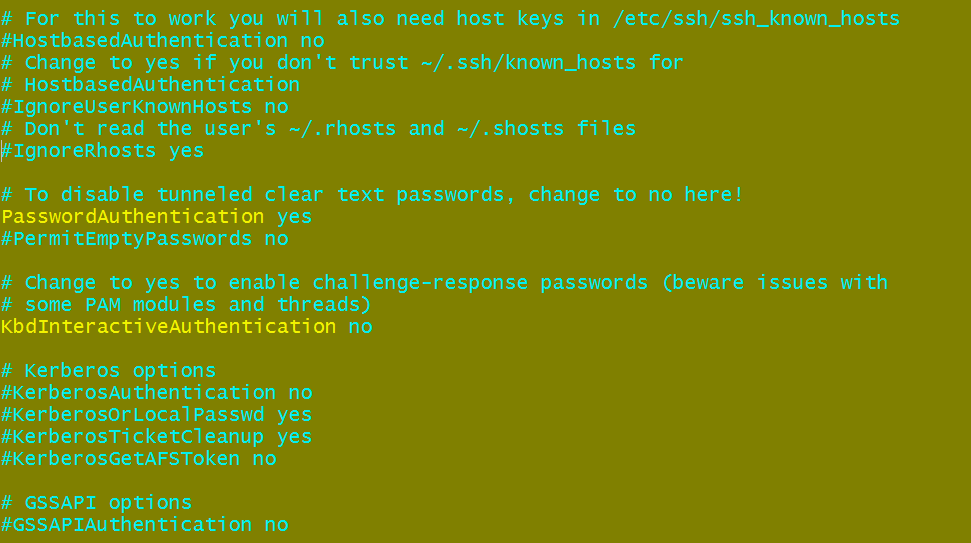
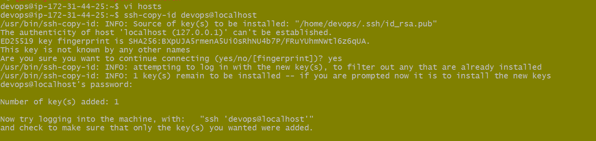

# Ansible Setup
## Passwordless Configurations
* Lets create Two virtual machines in Aws cloud 
  - ansible-control-node
  - workking-node

* Now login into the both machines
* Create a user called  as `devops`in ansible control node and working node
```
sudo useradd devops
```


* Give permission for password less for devops

  - AWS will not allow password authentication by default, so we need chnage the configuration rules
```
sudo vi /etc/ssh/sshd_config
```


  - Change the value of PasswordAuthentication to yes in

```
sudo vi /etc/ssh/sshd_config.d/60-clouding-settings.conf
```
 - restart the sshd service 
```
 sudo systemctl restart ssh.service
```
* We need to Grant permission to devops user
```
sudo visudo
```
 * Now add the following line
 ```
devops ALL=(ALL:ALL) NOPASSWD:ALL
```
* Now lets configure the key Based Authentication
 between ansible control node and working node
  - switch to devops user `su devops`
  - Create a key Pair `ssh-keygen` on ansible control node
  - Now copy the public key into working node
   `ssh-copy-id devops@<workingnode-ip>`
    

  - Now we are up for password less authentication

* Now install ansble on ansible control node [AnsibleInstall](https://docs.ansible.com/ansible/latest/installation_guide/installation_distros.html#installing-ansible-on-ubuntu)
```bash
sudo apt update
sudo apt install software-properties-common
sudo add-apt-repository --yes --update ppa:ansible/ansible
sudo apt install ansible -y`
```
 - To check ansible installed or not
 ```
 ansible --version
 ```
 
 
- Ansible requires python which is already installed on ubuntu `python3 --version` if not then install manually.
- Now crete a `host` file and perform ansible ping test

```
vi hosts
```
- Cpoy the Private IP address/name of working node in hostfile 

- run the below command
```
ansible - i hosts -m ping all
```
- The output


- You can your localhost in hosts file 


- Copy the public key in localhost
``` 
ssh-copy-id devops@localhost
```


- Now run the follwing command
```
 ansible -i hosts -m ping all
```


Here the configuration is done completely ...


